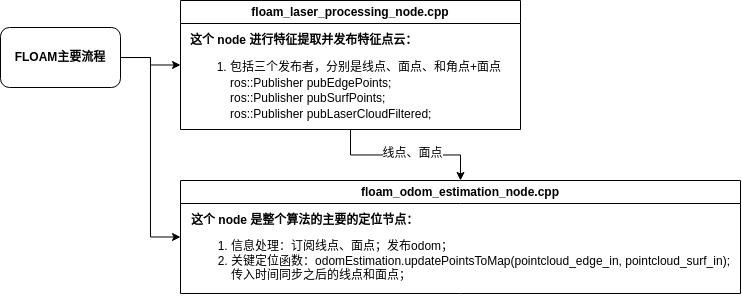

# SLAM_NOTED
该repo主要记录对目前SLAM算法的注释版本，包括：
- ✔ **FLOAM**：[⌨[code详细注释]](https://github.com/YZH-bot/SLAM_NOTED/tree/master/floam)
  - 主要流程：

  

- ✔ **direct_lidar_odemetry**：[📖[文献解读]](https://zhuanlan.zhihu.com/p/677991232)$~~~$[⌨[code详细注释]](https://github.com/YZH-bot/SLAM_NOTED/tree/master/direct_lidar_odometry)
- **fast_gicp**: [code解析详情：fastgicp](https://github.com/YZH-bot/SLAM_NOTED/tree/master/fast_gicp) [working on]
- **LIO-SAM**：[working on]
- **direct_inertial_lidar_odemetry**：[todo]

