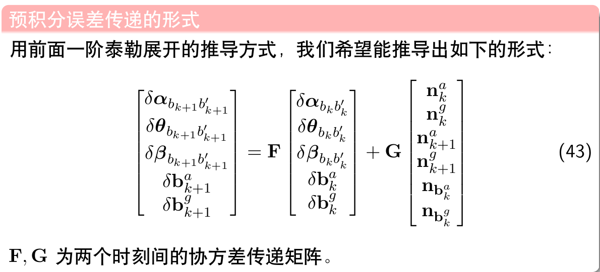
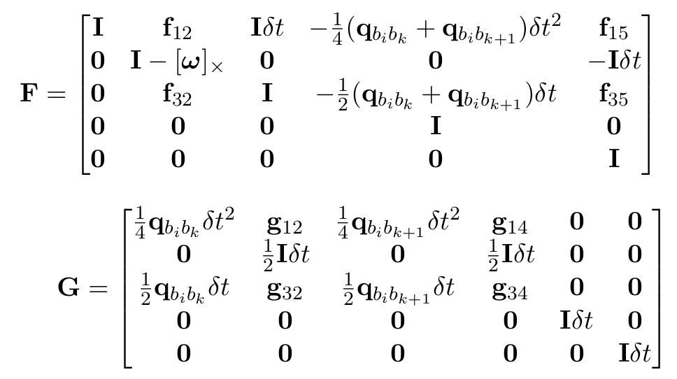
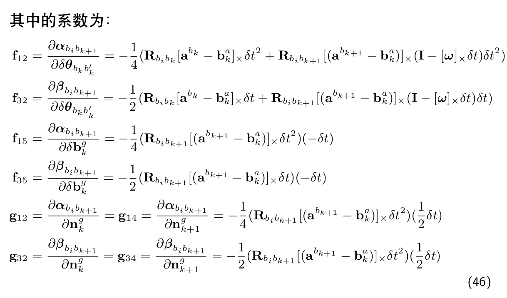

# 一、IMU Preintegration
## 输入
> 两个图像帧时刻之间的所有IMU数据

## 预积分函数
1. 计算两帧之间的$[P, V, Q, b_a, b_g, g]$:

```C++
// 前一时刻的imu加速度旋转到起始时刻坐标系下
Vector3d un_acc_0 = delta_q * (_acc_0 - linearized_ba);
// 角速度中值
Vector3d un_gyr = 0.5 * (_gyr_0 + _gyr_1) - linearized_bg;
// 更新旋转量
result_delta_q = delta_q * Quaterniond(1, un_gyr(0) * _dt / 2, un_gyr(1) * _dt / 2, un_gyr(2) * _dt / 2);
// 后一时刻的imu加速度旋转到起始时刻坐标系下, 这样两帧imu加速度都是相对于起始时刻坐标系
Vector3d un_acc_1 = result_delta_q * (_acc_1 - linearized_ba);
// 加速度的中值
Vector3d un_acc = 0.5 * (un_acc_0 + un_acc_1);
// 相对于起始时刻的位移和速度积分
result_delta_p = delta_p + delta_v * _dt + 0.5 * un_acc * _dt * _dt;
result_delta_v = delta_v + un_acc * _dt;
// b_a, b_g不变
result_linearized_ba = linearized_ba;
result_linearized_bg = linearized_bg;
```

2. 计算两帧之间的$[P, V, Q, b_a, b_g, g]$的Jacobian和Covariance:
主要就是对照这个公式:







```C++
Vector3d w_x = 0.5 * (_gyr_0 + _gyr_1) - linearized_bg;
Vector3d a_0_x = _acc_0 - linearized_ba;
Vector3d a_1_x = _acc_1 - linearized_ba;
Matrix3d R_w_x, R_a_0_x, R_a_1_x;

//反对称矩阵
R_w_x<<0, -w_x(2), w_x(1),
    w_x(2), 0, -w_x(0),
    -w_x(1), w_x(0), 0;
R_a_0_x<<0, -a_0_x(2), a_0_x(1),
    a_0_x(2), 0, -a_0_x(0),
    -a_0_x(1), a_0_x(0), 0;
R_a_1_x<<0, -a_1_x(2), a_1_x(1),
    a_1_x(2), 0, -a_1_x(0),
    -a_1_x(1), a_1_x(0), 0;

MatrixXd F = MatrixXd::Zero(15, 15);
F.block<3, 3>(0, 0) = Matrix3d::Identity();
F.block<3, 3>(0, 3) = -0.25 * delta_q.toRotationMatrix() * R_a_0_x * _dt * _dt + 
                        -0.25 * result_delta_q.toRotationMatrix() * R_a_1_x * (Matrix3d::Identity() - R_w_x * _dt) * _dt * _dt;
F.block<3, 3>(0, 6) = MatrixXd::Identity(3,3) * _dt;
F.block<3, 3>(0, 9) = -0.25 * (delta_q.toRotationMatrix() + result_delta_q.toRotationMatrix()) * _dt * _dt;
F.block<3, 3>(0, 12) = -0.25 * result_delta_q.toRotationMatrix() * R_a_1_x * _dt * _dt * -_dt;
F.block<3, 3>(3, 3) = Matrix3d::Identity() - R_w_x * _dt;
F.block<3, 3>(3, 12) = -1.0 * MatrixXd::Identity(3,3) * _dt;
F.block<3, 3>(6, 3) = -0.5 * delta_q.toRotationMatrix() * R_a_0_x * _dt + 
                        -0.5 * result_delta_q.toRotationMatrix() * R_a_1_x * (Matrix3d::Identity() - R_w_x * _dt) * _dt;
F.block<3, 3>(6, 6) = Matrix3d::Identity();
F.block<3, 3>(6, 9) = -0.5 * (delta_q.toRotationMatrix() + result_delta_q.toRotationMatrix()) * _dt;
F.block<3, 3>(6, 12) = -0.5 * result_delta_q.toRotationMatrix() * R_a_1_x * _dt * -_dt;
F.block<3, 3>(9, 9) = Matrix3d::Identity();
F.block<3, 3>(12, 12) = Matrix3d::Identity();
//cout<<"A"<<endl<<A<<endl;

MatrixXd V = MatrixXd::Zero(15,18);
V.block<3, 3>(0, 0) =  0.25 * delta_q.toRotationMatrix() * _dt * _dt;
V.block<3, 3>(0, 3) =  0.25 * -result_delta_q.toRotationMatrix() * R_a_1_x  * _dt * _dt * 0.5 * _dt;
V.block<3, 3>(0, 6) =  0.25 * result_delta_q.toRotationMatrix() * _dt * _dt;
V.block<3, 3>(0, 9) =  V.block<3, 3>(0, 3);
V.block<3, 3>(3, 3) =  0.5 * MatrixXd::Identity(3,3) * _dt;
V.block<3, 3>(3, 9) =  0.5 * MatrixXd::Identity(3,3) * _dt;
V.block<3, 3>(6, 0) =  0.5 * delta_q.toRotationMatrix() * _dt;
V.block<3, 3>(6, 3) =  0.5 * -result_delta_q.toRotationMatrix() * R_a_1_x  * _dt * 0.5 * _dt;
V.block<3, 3>(6, 6) =  0.5 * result_delta_q.toRotationMatrix() * _dt;
V.block<3, 3>(6, 9) =  V.block<3, 3>(6, 3);
V.block<3, 3>(9, 12) = MatrixXd::Identity(3,3) * _dt;
V.block<3, 3>(12, 15) = MatrixXd::Identity(3,3) * _dt;

//step_jacobian = F;
//step_V = V;
jacobian = F * jacobian;
covariance = F * covariance * F.transpose() + V * noise * V.transpose();
```

## 完整代码:
```C++
/**
* @brief   这个函数主要干两个事儿: IMU预积分中采用中值积分递推 和 计算Jacobian和Covariance用于优化更新和误差传递
*          构造误差的线性化递推方程，得到Jacobian和Covariance递推公式-> Paper 式9、10、11
* @return  void
*/
void midPointIntegration(double _dt, 
                        const Eigen::Vector3d &_acc_0, const Eigen::Vector3d &_gyr_0,
                        const Eigen::Vector3d &_acc_1, const Eigen::Vector3d &_gyr_1,
                        const Eigen::Vector3d &delta_p, const Eigen::Quaterniond &delta_q, const Eigen::Vector3d &delta_v,
                        const Eigen::Vector3d &linearized_ba, const Eigen::Vector3d &linearized_bg,
                        Eigen::Vector3d &result_delta_p, Eigen::Quaterniond &result_delta_q, Eigen::Vector3d &result_delta_v,
                        Eigen::Vector3d &result_linearized_ba, Eigen::Vector3d &result_linearized_bg, bool update_jacobian)
{
    //ROS_INFO("midpoint integration");
    // doc： 计算 imu 增量 https://zhuanlan.zhihu.com/p/385503298
    Vector3d un_acc_0 = delta_q * (_acc_0 - linearized_ba);
    Vector3d un_gyr = 0.5 * (_gyr_0 + _gyr_1) - linearized_bg;
    result_delta_q = delta_q * Quaterniond(1, un_gyr(0) * _dt / 2, un_gyr(1) * _dt / 2, un_gyr(2) * _dt / 2);
    Vector3d un_acc_1 = result_delta_q * (_acc_1 - linearized_ba);
    Vector3d un_acc = 0.5 * (un_acc_0 + un_acc_1);
    result_delta_p = delta_p + delta_v * _dt + 0.5 * un_acc * _dt * _dt;
    result_delta_v = delta_v + un_acc * _dt;
    result_linearized_ba = linearized_ba;
    result_linearized_bg = linearized_bg;         

    // doc: https://zhuanlan.zhihu.com/p/385503298
    if(update_jacobian)
    {
        Vector3d w_x = 0.5 * (_gyr_0 + _gyr_1) - linearized_bg;
        Vector3d a_0_x = _acc_0 - linearized_ba;
        Vector3d a_1_x = _acc_1 - linearized_ba;
        Matrix3d R_w_x, R_a_0_x, R_a_1_x;

        //反对称矩阵
        R_w_x<<0, -w_x(2), w_x(1),
            w_x(2), 0, -w_x(0),
            -w_x(1), w_x(0), 0;
        R_a_0_x<<0, -a_0_x(2), a_0_x(1),
            a_0_x(2), 0, -a_0_x(0),
            -a_0_x(1), a_0_x(0), 0;
        R_a_1_x<<0, -a_1_x(2), a_1_x(1),
            a_1_x(2), 0, -a_1_x(0),
            -a_1_x(1), a_1_x(0), 0;

        MatrixXd F = MatrixXd::Zero(15, 15);
        F.block<3, 3>(0, 0) = Matrix3d::Identity();
        F.block<3, 3>(0, 3) = -0.25 * delta_q.toRotationMatrix() * R_a_0_x * _dt * _dt + 
                                -0.25 * result_delta_q.toRotationMatrix() * R_a_1_x * (Matrix3d::Identity() - R_w_x * _dt) * _dt * _dt;
        F.block<3, 3>(0, 6) = MatrixXd::Identity(3,3) * _dt;
        F.block<3, 3>(0, 9) = -0.25 * (delta_q.toRotationMatrix() + result_delta_q.toRotationMatrix()) * _dt * _dt;
        F.block<3, 3>(0, 12) = -0.25 * result_delta_q.toRotationMatrix() * R_a_1_x * _dt * _dt * -_dt;
        F.block<3, 3>(3, 3) = Matrix3d::Identity() - R_w_x * _dt;
        F.block<3, 3>(3, 12) = -1.0 * MatrixXd::Identity(3,3) * _dt;
        F.block<3, 3>(6, 3) = -0.5 * delta_q.toRotationMatrix() * R_a_0_x * _dt + 
                                -0.5 * result_delta_q.toRotationMatrix() * R_a_1_x * (Matrix3d::Identity() - R_w_x * _dt) * _dt;
        F.block<3, 3>(6, 6) = Matrix3d::Identity();
        F.block<3, 3>(6, 9) = -0.5 * (delta_q.toRotationMatrix() + result_delta_q.toRotationMatrix()) * _dt;
        F.block<3, 3>(6, 12) = -0.5 * result_delta_q.toRotationMatrix() * R_a_1_x * _dt * -_dt;
        F.block<3, 3>(9, 9) = Matrix3d::Identity();
        F.block<3, 3>(12, 12) = Matrix3d::Identity();
        //cout<<"A"<<endl<<A<<endl;

        MatrixXd V = MatrixXd::Zero(15,18);
        V.block<3, 3>(0, 0) =  0.25 * delta_q.toRotationMatrix() * _dt * _dt;
        V.block<3, 3>(0, 3) =  0.25 * -result_delta_q.toRotationMatrix() * R_a_1_x  * _dt * _dt * 0.5 * _dt;
        V.block<3, 3>(0, 6) =  0.25 * result_delta_q.toRotationMatrix() * _dt * _dt;
        V.block<3, 3>(0, 9) =  V.block<3, 3>(0, 3);
        V.block<3, 3>(3, 3) =  0.5 * MatrixXd::Identity(3,3) * _dt;
        V.block<3, 3>(3, 9) =  0.5 * MatrixXd::Identity(3,3) * _dt;
        V.block<3, 3>(6, 0) =  0.5 * delta_q.toRotationMatrix() * _dt;
        V.block<3, 3>(6, 3) =  0.5 * -result_delta_q.toRotationMatrix() * R_a_1_x  * _dt * 0.5 * _dt;
        V.block<3, 3>(6, 6) =  0.5 * result_delta_q.toRotationMatrix() * _dt;
        V.block<3, 3>(6, 9) =  V.block<3, 3>(6, 3);
        V.block<3, 3>(9, 12) = MatrixXd::Identity(3,3) * _dt;
        V.block<3, 3>(12, 15) = MatrixXd::Identity(3,3) * _dt;

        //step_jacobian = F;
        //step_V = V;
        jacobian = F * jacobian;
        covariance = F * covariance * F.transpose() + V * noise * V.transpose();
    }

}
```

# 二、VIO的初始化

## 1. 初始相机-IMU旋转外参估计
### 输入
> 两帧图像之间的特征点对, IMU预积分项的旋转部分

```C++
// doc: 如果没有外参则进行标定
if(ESTIMATE_EXTRINSIC == 2)
{
    ROS_INFO("calibrating extrinsic param, rotation movement is needed");
    if (frame_count != 0)
    {
        // doc: 得到两帧图像帧之间归一化特征点
        vector<pair<Vector3d, Vector3d>> corres = f_manager.getCorresponding(frame_count - 1, frame_count);
        Matrix3d calib_ric;
        // doc: 标定从camera到IMU之间的旋转矩阵, 输入: 图像特征点对, IMU预积分项旋转部分
        if (initial_ex_rotation.CalibrationExRotation(corres, pre_integrations[frame_count]->delta_q, calib_ric))
        {
            ROS_WARN("initial extrinsic rotation calib success");
            ROS_WARN_STREAM("initial extrinsic rotation: " << endl << calib_ric);
            ric[0] = calib_ric;
            RIC[0] = calib_ric;
            ESTIMATE_EXTRINSIC = 1;
        }
    }
}
```

- 基于SVD进行外参估计:


```C++
// doc: 标定外参的旋转矩阵
bool InitialEXRotation::CalibrationExRotation(vector<pair<Vector3d, Vector3d>> corres, Quaterniond delta_q_imu, Matrix3d &calib_ric_result)
{
    frame_count++;
    Rc.push_back(solveRelativeR(corres));// doc: 帧间cam的R，由对极几何得到, 求解本质矩阵
    Rimu.push_back(delta_q_imu.toRotationMatrix());// doc: 帧间IMU的R，由IMU预积分得到
    Rc_g.push_back(ric.inverse() * delta_q_imu * ric);// doc: IMU预积分相对于camera的R

    Eigen::MatrixXd A(frame_count * 4, 4);
    A.setZero();
    int sum_ok = 0;
    // doc: 初始化的时候push了一个单位阵,所以从 1 开始没问题
    for (int i = 1; i <= frame_count; i++)
    {
        Quaterniond r1(Rc[i]);  
        Quaterniond r2(Rc_g[i]);

        double angular_distance = 180 / M_PI * r1.angularDistance(r2);
        ROS_DEBUG("%d %f", i, angular_distance);

        // doc: huber核函数做加权
        double huber = angular_distance > 5.0 ? 5.0 / angular_distance : 1.0;
        ++sum_ok;
        Matrix4d L, R;

        //R_bk+1^bk * R_c^b = R_c^b * R_ck+1^ck
        //[Q1(q_bk+1^bk) - Q2(q_ck+1^ck)] * q_c^b = 0
        //L R 分别为左乘和右乘矩阵
        double w = Quaterniond(Rc[i]).w();
        Vector3d q = Quaterniond(Rc[i]).vec();
        L.block<3, 3>(0, 0) = w * Matrix3d::Identity() + Utility::skewSymmetric(q);
        L.block<3, 1>(0, 3) = q;
        L.block<1, 3>(3, 0) = -q.transpose();
        L(3, 3) = w;

        Quaterniond R_ij(Rimu[i]);
        w = R_ij.w();
        q = R_ij.vec();
        R.block<3, 3>(0, 0) = w * Matrix3d::Identity() - Utility::skewSymmetric(q);
        R.block<3, 1>(0, 3) = q;
        R.block<1, 3>(3, 0) = -q.transpose();
        R(3, 3) = w;

        // doc: huber核函数做加权
        A.block<4, 4>((i - 1) * 4, 0) = huber * (L - R);
    }

    // doc: svd分解中最小奇异值对应的右奇异向量作为旋转四元数
    JacobiSVD<MatrixXd> svd(A, ComputeFullU | ComputeFullV);
    Matrix<double, 4, 1> x = svd.matrixV().col(3);
    Quaterniond estimated_R(x);
    ric = estimated_R.toRotationMatrix().inverse();
    //cout << svd.singularValues().transpose() << endl;
    //cout << ric << endl;
    Vector3d ric_cov;
    ric_cov = svd.singularValues().tail<3>();

    // doc: 至少迭代计算了WINDOW_SIZE次，且R的奇异值大于0.25才认为标定成功
    if (frame_count >= WINDOW_SIZE && ric_cov(1) > 0.25)
    {
        calib_ric_result = ric;
        return true;
    }
    else
        return false;
}
```

## feature处理部分
**问题:**
1. 特征点是怎么存储的?