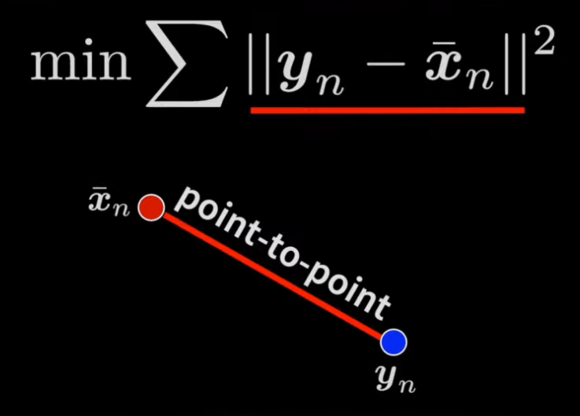
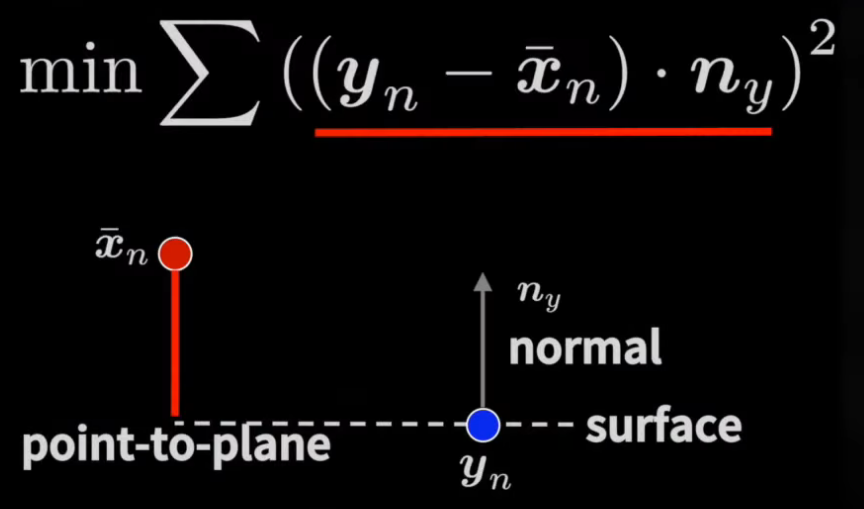
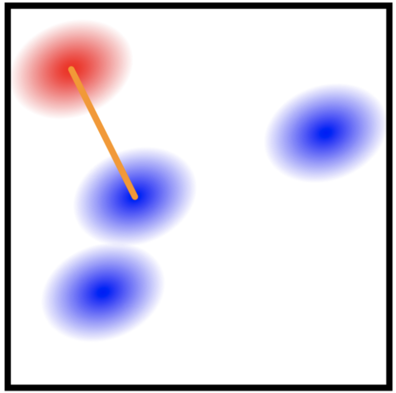

# GICP 算法（ICP汇总）

[TOC]

## ICP 算法介绍 
|                 point-to-point icp                  |                 point-to-plane icp                  |                                      point-to-plane icp                                      |
| :-------------------------------------------------: | :-------------------------------------------------: | :------------------------------------------------------------------------------------------: |
|  |  |                                                      |
|     优化源点集与目标点集中对应点之间位置的偏差      |       优化源点集与目标点集中对应点平面的偏差        | 每个点都服从高斯分布，  也就是说每对对应点不需要完美对应上，  尽可能提高对应的概率即可 |

## GICP 原理：
假定我们找到了一对匹配点 $\pmb{a}_i$ 和 $\pmb{b}_i$ 的最优匹配为 $\pmb{T}$，那么：

$$
\begin{equation}
    \hat{\pmb{b}}_i = \pmb{T}\hat{\pmb{a}}_i
\end{equation}
$$

定义它们之间的距离残差为 $d_i^{(\pmb{T})} = \hat{\pmb{b}}_i - \pmb{T^*}\hat{\pmb{a}}_i$，假设 $\pmb{a}_i$ 和 $\pmb{b}_i$ 独立，则：

$$
\begin{equation}\begin{split}
d_{i}^{(\mathbf{T})}& \sim\mathcal{N}\left(\hat{b_i}-\left(\mathbf{T}\right)\hat{a_i},C_i^B+\left(\mathbf{T}\right)C_i^A\left(\mathbf{T}\right)^T\right)  \\
&=\mathcal{N}\left(0,C_i^B+\left(\mathbf{T}\right)C_i^A\left(\mathbf{T}\right)^T\right)
\end{split}\end{equation}
$$

GICP通过最大似然估计，找到置信最高的变换矩阵 $\pmb{T}$：

$$
\begin{equation}\begin{aligned}
\mathbf{T}& =\mathop{\arg\max}\limits_{\mathbf{T}}\prod_ip\left(d_i^{(\mathbf{T})}\right)  \\
&={\mathop{\arg\max}\limits_{\mathbf{T}}}\sum_i\log\left(p\left(d_i^{(\mathbf{T})}\right)\right) \\
&=\mathop{\arg\max}\limits_{\mathbf{T}}\sum_i {d_i^{(\mathbf{T})}}^T\left(C_i^B+\mathbf{T}C_i^A\mathbf{T}^T\right)^{-1}d_i^{(\mathbf{T})}
\end{aligned}\end{equation}
$$

这是GICP中最核心的优化函数。 $\left(C_i^B+\mathbf{T}C_i^A\mathbf{T}^T\right)^{-1}$ 是source点云与target点云对应点的局部协方差矩阵，这个项会影响对应残差在优化过程中的权重，加快收敛速度和精度。 
此外:
* 点到点匹配 ➡ $C_i^B = I,\space C_i^A = 0$
* 点到面匹配 ➡ $C_i^B = (\pmb{n}_i\pmb{n}_i^T)^{-1},\space C_i^A = 0$
  * 其中 $\pmb{n}_i\pmb{n}_i^T$ 是一个正交投影矩阵 ( $P = P^T, P^2 = P$)  ，相当于把点与点之间的距离投影到法向量上，得到点到面的距离。
* 面到面匹配 ➡ GICP

## 附录
前置知识，多元高斯分布的概率密度函数：

$$
\begin{equation}\mathrm{f_x(x_1,...,x_k)=\frac1{\sqrt{(2\pi)^k|\Sigma|}}e^{-\frac12(x-\mu)^T\Sigma^{-1}(x-\mu)},|\Sigma|\triangleq det\Sigma}\end{equation}
$$

公式(3)目标函数的推导:

$$
\begin{equation}\begin{aligned}
\text{T}
&=\underset{\mathrm{T}}{\operatorname*{\arg\max}}\prod_{\mathrm{i}}\text{p}(\mathrm{d}_{\mathrm{i}}^{(\mathbf{T})})  \\
&=\arg\max_{\mathrm{T}}\sum_{\mathrm{i}}\log(\mathrm{p(d_i^{(T)})}) \\
&=\arg\max_{\mathrm{T}}\sum_\text{i}{ \log ( \frac 1 { \sqrt { ( 2 \pi ) ^ \mathrm{k}|\mathrm{C}_\mathrm{i}^\mathrm{B}+\mathbf{T}\mathrm{C}_\mathrm{i}^\mathrm{A}\mathbf{T}^\mathrm{T}|}})} \\
&-\frac12(\mathrm{d_i^{(T)}-(\hat{b_i}-T\hat{a_i})})^{\mathrm{T}}(\mathrm{C_i^B+TC_i^AT^T})^{-1}(\mathrm{d_i^{(T)}-(\hat{b_i}-T\hat{a_i})}) \\

\end{aligned}\end{equation}
$$